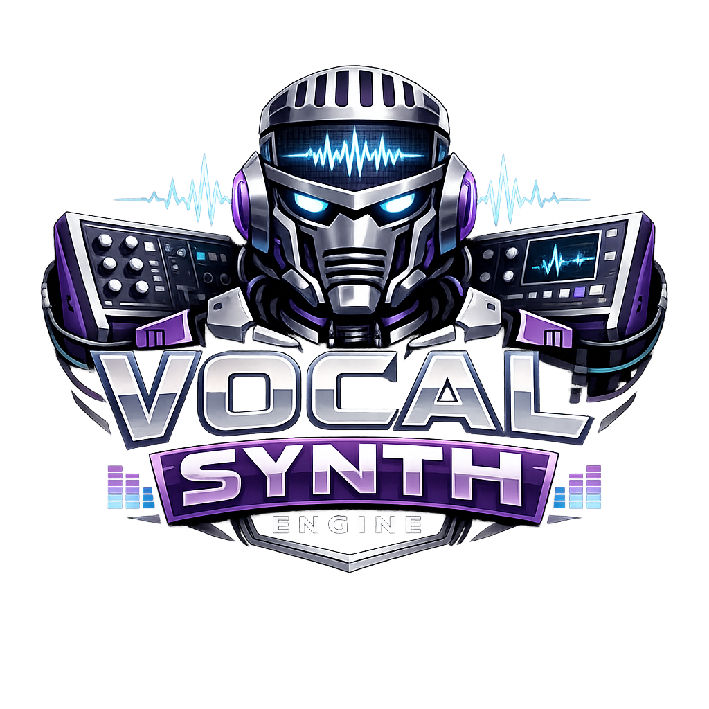

<p align="center">
  <a href="README.md">English</a> ·
  <a href="README.ja.md">日本語</a> ·
  <a href="README.zh.md">中文</a> ·
  <a href="README.es.md">Español</a> ·
  <a href="README.fr.md">Français</a> ·
  <a href="README.hi.md">हिन्दी</a> ·
  <a href="README.it.md">Italiano</a> ·
  <a href="README.pt-BR.md">Português</a>
</p>

<p align="center">
  
</p>

<p align="center">
  <a href="https://github.com/mcp-tool-shop-org/vocal-synth-engine/actions/workflows/ci.yml"></a>
  
  <a href="https://mcp-tool-shop-org.github.io/vocal-synth-engine/"></a>
</p>

<p align="center"><strong>Deterministic vocal instrument engine — additive synthesis, voice presets, real-time WebSocket streaming, multi-user jam sessions, cockpit UI</strong></p>

Un motor de instrumento vocal determinista construido en TypeScript. Genera voces cantadas a partir de datos de partituras utilizando síntesis aditiva, preajustes de voz y transmisión en tiempo real a través de WebSocket. Permite la interpretación en vivo a través de teclado/MIDI, la colaboración en sesiones multijugador y la conversión de partituras a formato WAV.

## ¿Qué hace?

- **Síntesis vocal aditiva** — armónicos + envolvente espectral + ruido residual.
- **15 preajustes de voz** — análisis de voces de Kokoro TTS y preajustes de laboratorio, cada uno con múltiples timbres.
- **Renderizado polifónico** — polifonía máxima configurable con gestión de estado por voz y "voice stealing" (asignación dinámica de voces).
- **Modo en vivo** — interpretación de notas a través de teclado o MIDI con transmisión de audio en tiempo real a través de WebSocket.
- **Sesiones colaborativas** — sesiones multijugador con autoridad del anfitrión, atribución de participantes y grabación.
- **Entrada de partituras** — carga de una `VocalScore` en una pista para reproducción automática sincronizada con el transporte.
- **Grabación y exportación** — captura de interpretaciones en vivo en una "EventTape", exportación a WAV con metadatos completos.
- **Letras y fonemas** — proceso de conversión de grafemas a fonemas con visualización de la "pista" de fonemas.
- **Interfaz de usuario (UI) "Cockpit"** — aplicación web (SPA) basada en navegador con editor de piano roll, teclado en vivo, panel XY, banco de renderizado y telemetría.
- **Determinista** — generador de números aleatorios (RNG) con semilla, salida reproducible a partir de las mismas entradas.

## Arquitectura

```
                          ┌─── Cockpit UI (browser SPA) ───┐
                          │  Piano Roll  │  Live  │ Renders │
                          └──────────────┴────────┴─────────┘
                                     │        │
                              REST API    WebSocket
                                     │    /ws  /ws/jam
                          ┌──────────┴────────┴─────────────┐
                          │        Express Server            │
                          │  Render API │ Jam Sessions       │
                          └──────┬──────┴───────┬────────────┘
                                 │              │
                      StreamingVocalSynthEngine  │
                        LiveSynthEngine ─────────┘
                                 │
                    ┌────────────┼─────────────┐
              VoicePreset    DSP (FFT)    Curves (ADSR,
              (.f32 blobs)   Pitch Det.   vibrato, automation)
```

**Directorios clave:**

| Directorio | Propósito |
| ----------- | --------- |
| `src/engine/` | Núcleo del sintetizador — renderizador de bloques, motor de transmisión, curvas ADSR/vibrato. |
| `src/dsp/` | Procesamiento de señales — FFT, detección de tono. |
| `src/preset/` | Esquema, cargador y resolutor de preajustes de voz. |
| `src/server/` | Servidor de API Express + WebSocket, gestor de sesiones colaborativas. |
| `src/types/` | Tipos compartidos — partituras, protocolo de sesión colaborativa, preajustes. |
| `src/cli/` | Herramientas de línea de comandos (CLI) y suites de pruebas de integración. |
| `apps/cockpit/` | Interfaz de usuario (UI) "Cockpit" para navegador (Vite + TypeScript nativo). |
| `presets/` | 15 preajustes de voz incluidos con datos de timbre binarios. |

## Cómo empezar

```bash
npm ci
npm run dev
```

El servidor de desarrollo se inicia en `http://localhost:4321`. La interfaz de usuario (UI) "Cockpit" se sirve desde el mismo puerto.

## Interfaz de usuario (UI) "Cockpit"

La interfaz de usuario (UI) "Cockpit" es una aplicación web (SPA) basada en navegador con tres pestañas:

### Editor de partituras
- Piano roll con funciones de arrastrar para crear, mover y redimensionar notas (rango C2-C6).
- Controles por nota: velocidad, timbre, "breathiness" (respiración), vibrato, portamento.
- Entrada de letras con generación automática de fonemas.
- Superposición de la "pista" de fonemas sincronizada con el piano roll.
- Renderizado a WAV con preajuste, polifonía, semilla y BPM configurables.

### Modo en vivo
- Teclado cromático de 24 teclas (ratón + atajos de teclado).
- Entrada de dispositivo MIDI con filtrado de canal.
- Panel XY para la modulación de timbre en tiempo real (eje X) y "breathiness" (eje Y).
- Pedal de sostenimiento, controles deslizantes de velocidad/ "breathiness", controles de vibrato.
- Metrónomo con cuadrícula de cuantización (1/4, 1/8, 1/16).
- Calibración de latencia (preajustes de baja, equilibrada y segura).
- Grabación de interpretaciones y guardado en el banco de renderizado.
- Telemetría en tiempo real: voces, nivel máximo de dBFS, RTF (tiempo de respuesta), riesgo de "clics", fluctuación de WebSocket.

### Banco de renderizado
- Exploración, reproducción, fijación, cambio de nombre y eliminación de renderizados guardados.
- Carga de la partitura de un renderizado de nuevo en el editor.
- Comparación lado a lado de la telemetría entre renderizados.
- Seguimiento de la procedencia: SHA del commit, hash de la partitura, hash de WAV.

## Sesiones colaborativas

Sesiones colaborativas multijugador a través de WebSocket (`/ws/jam`):

- **Autoridad del anfitrión** — el creador de la sesión controla la reproducción, el seguimiento, la grabación y la cuantización.
- **Participación de invitados** — los invitados pueden tocar notas en cualquier pista, pero no pueden modificar el estado de la sesión.
- **Propiedad de la pista** — las pistas pertenecen a su creador; solo el propietario o el anfitrión pueden modificarlas o eliminarlas.
- **Atribución de participantes** — cada evento de nota en la cinta de eventos registra quién lo tocó.
- **Modo de entrada de partitura** — carga una `VocalScore` en una pista para la reproducción automática sincronizada con la reproducción.
- **Grabación** — captura las notas de todos los participantes en una cinta de eventos, exporta a formato WAV.
- **Metrónomo** — metrónomo compartido con BPM y compás configurables.

### Protocolo Jam

Los clientes se conectan a `/ws/jam` e intercambian mensajes JSON:

```
Client: jam_hello → Server: jam_hello_ack (participantId)
Client: session_create → Server: session_created (snapshot)
Client: session_join → Server: session_joined (snapshot)
Client: track_note_on/off → Server: track_note_ack
Client: record_start/stop → Server: record_status
Client: record_export → Server: record_exported (renderId)
Client: track_set_score → Server: score_status
```

## API

| Punto de acceso | Método | Auth | Descripción |
| ---------- | -------- | ------ | ------------- |
| `/api/health` | GET | No | Estado del servidor, versión, tiempo de actividad |
| `/api/presets` | GET | No | Lista de preajustes de voz con timbres y metadatos. |
| `/api/phonemize` | POST | Yes | Convierte texto de letras en eventos fonéticos. |
| `/api/render` | POST | Yes | Renderiza una partitura a formato WAV. |
| `/api/renders` | GET | Yes | Lista de todas las renderizaciones guardadas. |
| `/api/renders/:id/audio.wav` | GET | Yes | Descarga la renderización en formato WAV. |
| `/api/renders/:id/score` | GET | Yes | Partitura JSON original. |
| `/api/renders/:id/meta` | GET | Yes | Metadatos de la renderización. |
| `/api/renders/:id/telemetry` | GET | Yes | Telemetría de la renderización (pico, RTF, clics). |
| `/api/renders/:id/provenance` | GET | Yes | Origen (commit, hashes, configuración). |

La autenticación es opcional; se habilita cuando `AUTH_TOKEN` está configurado en el entorno.

### WebSocket

| Path | Propósito |
| ------ | --------- |
| `/ws` | Modo en vivo: reproducción de notas de un solo usuario con transmisión de audio. |
| `/ws/jam` | Sesiones Jam: colaboración multiusuario con grabación. |

## Preajustes de voz

15 preajustes incluidos con soporte de múltiples timbres:

| Preajuste | Voice | Timbres |
| -------- | ------- | --------- |
| `default-voice` | Femenino estándar | Tímbre predeterminado |
| `bright-lab` | Laboratorio/experimental | Formante brillante |
| `kokoro-af-*` | Aoede, Heart, Jessica, Sky | Múltiples por voz |
| `kokoro-am-*` | Eric, Fenrir, Liam, Onyx | Múltiples por voz |
| `kokoro-bf-*` | Alice, Emma, Isabella | Múltiples por voz |
| `kokoro-bm-*` | George, Lewis | Múltiples por voz |

Cada preajuste incluye archivos binarios `.f32` (magnitudes armónicas, envolvente espectral, nivel de ruido) y un manifiesto JSON que describe el rango de tono, la resonancia y los valores predeterminados del vibrato.

## Scripts

```bash
npm run dev          # Dev server with hot reload
npm run build        # Build cockpit + server
npm start            # Production server
npm run inspect      # CLI preset inspector
```

## Pruebas

Las pruebas de integración se ejecutan contra un servidor de desarrollo en vivo:

```bash
# Start the server first
npm run dev

# Then in another terminal:
npx tsx src/cli/test-jam-session.ts        # Jam session lifecycle (12 tests)
npx tsx src/cli/test-jam-recording.ts      # Recording & export (10 tests)
npx tsx src/cli/test-jam-collaboration.ts  # Collaboration & score input (12 tests)
npx tsx src/cli/test-score-render.ts       # Score rendering pipeline
npx tsx src/cli/test-consonants.ts         # Consonant phonemes
npx tsx src/cli/test-g2p.ts               # Grapheme-to-phoneme
npx tsx src/cli/test-lyrics-golden.ts      # Lyrics golden tests
npx tsx src/cli/test-multi-timbre.ts       # Multi-timbre rendering
npx tsx src/cli/test-noise-tail.ts         # Tail silence/noise
```

## Licencia

MIT. Ver [LICENSE](LICENSE).
